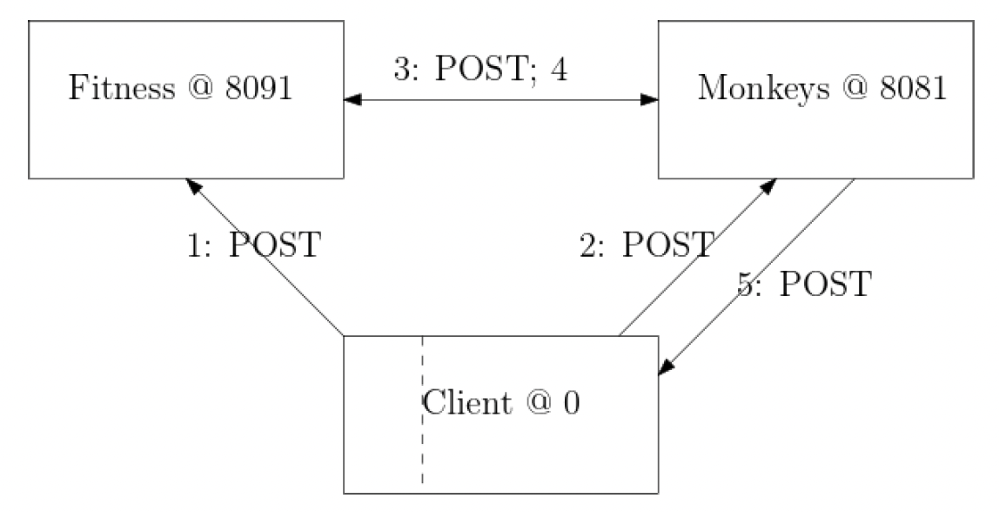

# Infinite Monkey

## Description
This application is a distibuted system that illustrates **the Shakespearean Monkeys genetic algorithm.** The genetic algorithm will generate a pool of strings. A Similarity score (Hamming distance) will be computed for each string. The application repeats the process untill a perfect match is found.

**Example**
>**Target String**: The answer, my friend, is blowing in the wind.
>**Generated String**: The answerL my friend, is @lowing in t~e wind.

There are three standalone REST Carter servers: 
1.  Monkeys
    - listens on HTTP port 8081.
    - deploys the genetic algorithm to generate new strings.
2.  Fitness
    - listens on HTTP port 8091. 
    - Calculates the hamming distance between the target string and generated string from Monkeys.

3. Client
    - sends POST request to both Monkeys and Fitness

## GUI
There is also a browser app implementation of the client, using Blazor and SignalR.
